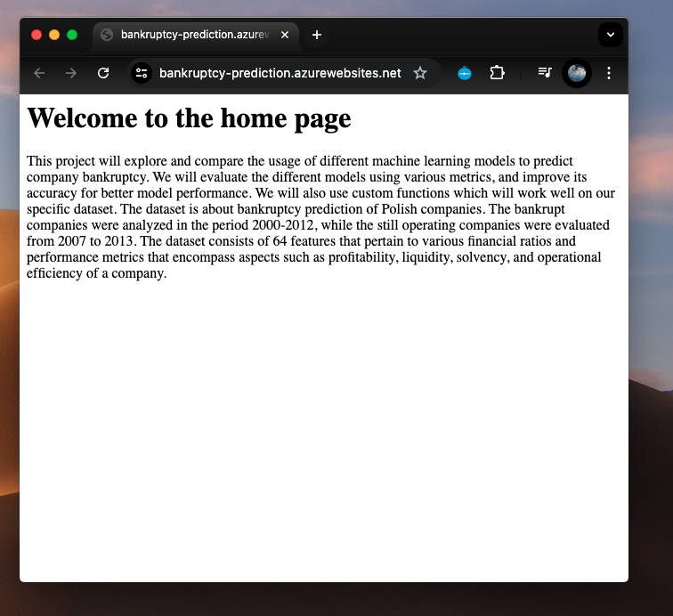
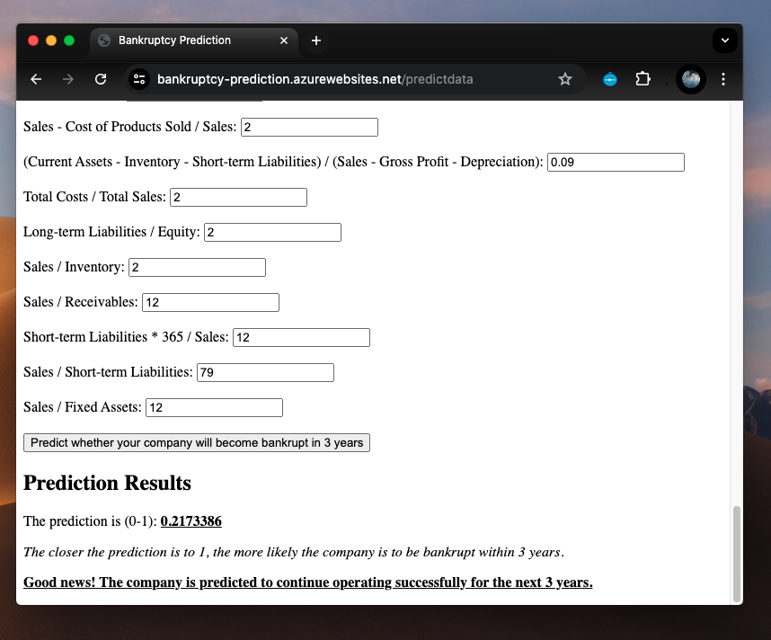

[](https://github.com/ChinSekYi/Bankruptcy-Prediction/actions/workflows/main.yml)
# Predict Company Bankruptcy using Machine Learning

<div style="display: flex; justify-content: center;">
  
  
  
</div>

## Project Motivation
In today's dynamic business environment, anticipating financial risks is crucial. This project aims to develop a predictive model for company bankruptcy using advanced machine learning algorithms and financial data analysis. By identifying early signs of financial distress, stakeholders can make informed decisions to prevent bankruptcy, minimizing financial losses.

## Description
We explore various machine learning models to predict company bankruptcy, focusing on improving accuracy. The dataset, from Polish companies, spans 2000-2013 and includes 64 features related to profitability, liquidity, solvency, and operational efficiency.
Our project will explore and compare the usage of different machine learning models to predict company bankruptcy. We will evaluate the different models using various metrics, and improve their accuracy for better model performance. 

## Proposed solution
We employ multiple predictive models, including logistic regression, k-nearest neighbors, and decision trees, with logistic regression as the benchmark. Ensemble methods like bagging, boosting, and random forests will enhance predictive capabilities, providing a comprehensive understanding of financial risk.

## Dataset Description
**Source:** <a href="https://archive.ics.uci.edu/dataset/365/polish+companies+bankruptcy+data" target="_blank">Polish Companies Bankruptcy Data</a>

Features Include:
- Net profit / total assets
- Total liabilities / total assets
- Working capital / total assets
- Current assets / short-term liabilities
- And many more financial ratios and metrics.

<br>

   
## Setup virtual environment for Developers
To ensure consistent package versions among collaborators.

### Install Anaconda:
- <a href="https://docs.anaconda.com/free/miniconda/index.html" target="_blank">Miniconda Installation Guide</a>
- <a href="https://docs.conda.io/projects/conda/en/latest/user-guide/install/windows.html" target="_blank">Windows Installation Guide</a>

### Verify Conda Installation
```
conda --version
```

### Create conda virtual environment
```
conda create -n dev python=3.11 
conda activate dev
```

### Install Project Dependencies   
```
pip install -r requirements.txt
```

### Clone the Repository
Ensure you have Git installed, then clone the project repository:
```
git clone https://github.com/ChinSekYi/Bankruptcy-Prediction.git
cd Bankruptcy-Prediction
```
<br>

    
## Accessing the WebApp
### Run Flask app using CLI
```
cd Bankruptcy-Prediction
python3 app.py
```

### Access Application
Then, click on one of the links below:  
- <a href="http://0.0.0.0:5001" target="_blank">Home page</a>
- <a href="http://0.0.0.0:5001/predictdata" target="_blank">Prediction page</a>

### Access WebApp deployed through Microsoft Azure (Not active for now to avoid billing)
- <a href="https://bankruptcy-prediction.azurewebsites.net/" target="_blank">Home page</a>
- <a href="https://bankruptcy-prediction.azurewebsites.net/predictdata" target="_blank">Prediction page</a>
 
