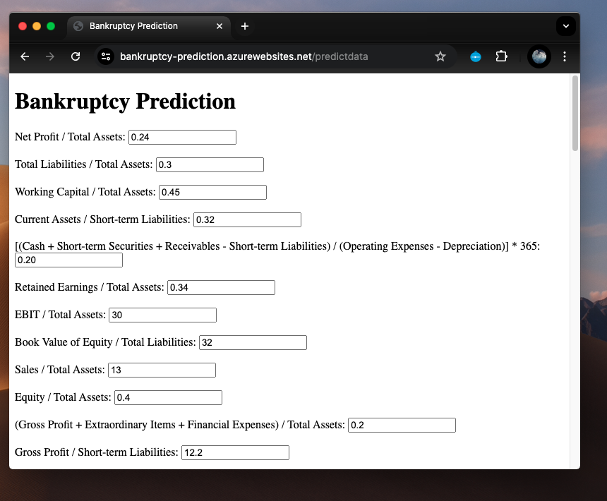

# Predict Company Bankruptcy using Machine Learning

<div style="display: flex; justify-content: center;">
  
  
  
</div>

## Table of Contents
1. [Project Motivation and Description](#project-motivation-and-description)
2. [Proposed solution](#proposed-solution)
3. [Dataset](#dataset)
4. [Technologies Used](#technologies-used)
5. [Installation](#installation)
6. [Makefile Commands](#makefile-commands)
7. [Usage](#usage)
8. [Accessing the WebApp](#accessing-the-webapp)
   
## Project Motivation and Description
In today's dynamic business environment, anticipating financial risks is crucial. This project aims to develop a predictive model for company bankruptcy using advanced machine learning algorithms and financial data analysis. By identifying early signs of financial distress, stakeholders can make informed decisions to prevent bankruptcy, minimizing financial losses.

We explore various machine learning models to predict company bankruptcy, focusing on improving accuracy. The dataset, from Polish companies, spans 2000-2013 and includes 64 features related to profitability, liquidity, solvency, and operational efficiency.
Our project will explore and compare the usage of different machine learning models to predict company bankruptcy. We will evaluate the different models using various metrics, and improve their accuracy for better model performance. 

## Proposed solution
We employ multiple predictive models, including logistic regression, k-nearest neighbors, and decision trees, with logistic regression as the benchmark. Ensemble methods like bagging, boosting, and random forests will enhance predictive capabilities, providing a comprehensive understanding of financial risk.

## Dataset
**Source:** <a href="https://archive.ics.uci.edu/dataset/365/polish+companies+bankruptcy+data" target="_blank">Polish Companies Bankruptcy Data</a>

Features Include:
- Net profit / total assets
- Total liabilities / total assets
- Working capital / total assets
- Current assets / short-term liabilities
- And many more financial ratios and metrics.

   
## Installation
1. Clone the Repository
    ```
    git clone https://github.com/ChinSekYi/Bankruptcy-Prediction.git
    cd Bankruptcy-Prediction
    ```

2. Create and activate virtual environment  
     Using Anaconda:  
    - <a href="https://docs.anaconda.com/free/miniconda/index.html" target="_blank">Miniconda Installation Guide</a>
    - <a href="https://docs.conda.io/projects/conda/en/latest/user-guide/install/windows.html" target="_blank">Windows Installation Guide</a>
    ```
    conda create -n dev python=3.11 
    conda activate dev
    ```
    Using venv:
    ```
    python -m venv dev
    source dev/bin/activate  #On macOS/Linux
    source dev/bin/activate  #On Windows
    ```

3. Install Project Dependencies   
    ```
    make install
    ```

## Makefile Commands
- `make install`: Upgrades `pip` and installs the dependencies listed in `requirements.txt`.
- `make test`: Runs tests using `pytest` on `test.py`. (Note: You can also run tests on notebooks by uncommenting the `#--nbval` line if needed.)
- `make format`: Formats all Python files using `isort` and `black`.
- `make run`: Runs the `main.py` script.
- `make lint`: Lints the code with `pylint`, excluding certain message types (R and C) for the specified directories and files.
- `make all`: Executes `install`, `format`, and `lint` commands in sequence.


## Usage
Open the following 3 notebooks:
  - For Exploratory Data Analysis, Data Cleaning and Data Preprocessing:
    ```
    jupyter notebook notebook/EDA.ipynb   
    ```
  - For Feature Selection:
    ```
    jupyter notebook notebook/FEATURE_SELECTION.ipynb   
    ```
  - For Model Training and Evaluation:
    ```
    jupyter notebook notebook/MODEL_TRAINING.ipynb   
    ```

## Accessing the WebApp
1. Run Flask app using CLI
    ```
    cd Bankruptcy-Prediction
    python3 app.py
    ```

    Then, access the application by clicking on one of the links below:  
    - <a href="http://0.0.0.0:5001" target="_blank">Home page</a>
    - <a href="http://0.0.0.0:5001/predictdata" target="_blank">Prediction page</a>

2. Access WebApp deployed through Microsoft Azure (Not active for now to avoid billing)
    - <a href="https://bankruptcy-prediction.azurewebsites.net/" target="_blank">Home page</a>
    - <a href="https://bankruptcy-prediction.azurewebsites.net/predictdata" target="_blank">Prediction page</a>
   
